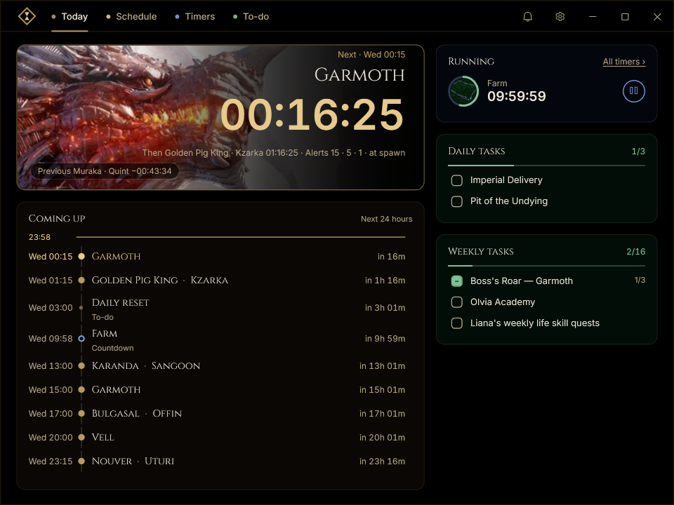
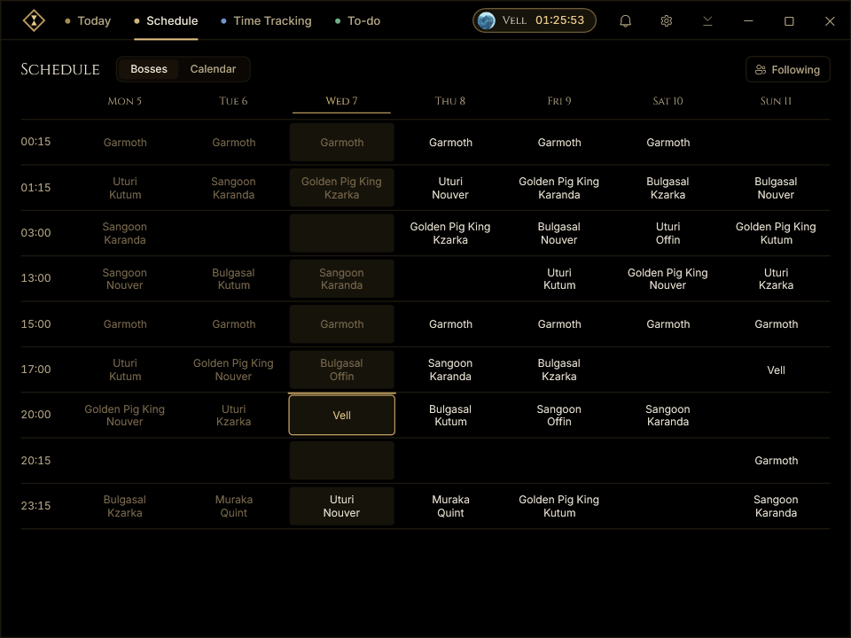
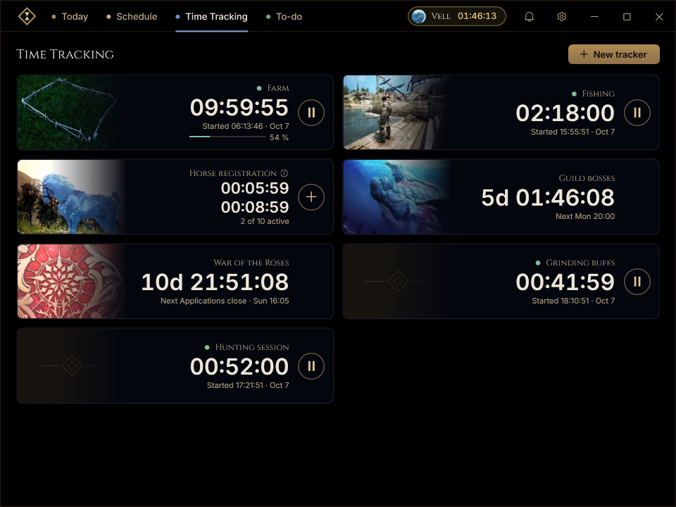
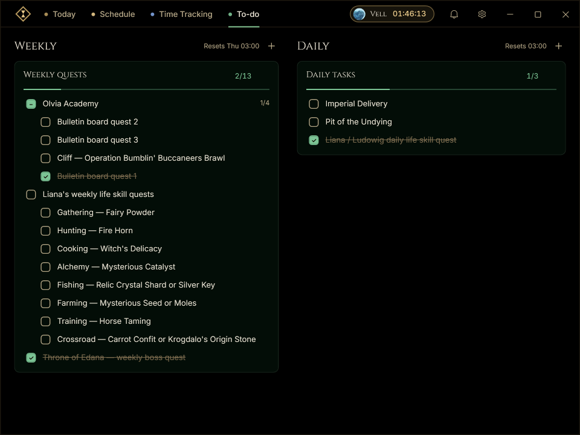
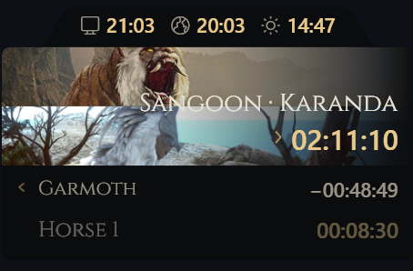
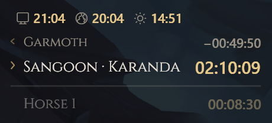

  

<h1 align="center">BDO Timers</h1>

World bosses, life skill timers and checklists for Black Desert Online.

Windows 10 / 11 &nbsp; · &nbsp; x64 &nbsp; · &nbsp; Europe &amp; North America

Most of the app is customizable, from timers and alerts to shortcuts and the overlay.

  <a href="https://github.com/feluminais/BdoTimers/releases"><strong>Releases</strong></a>
  &nbsp; · &nbsp;
  <a href="https://github.com/feluminais/BdoTimers/issues">Report an issue</a>
  &nbsp; · &nbsp;
  <a href="CONTRIBUTING.md">Build &amp; contribute</a>

## Today

The next boss spawn counts down at the top, with the one after it and the alert times. Below it, the next 24 hours of
spawns, timers and resets; on the right, the timers that are running and your daily and weekly tasks.

## Schedule

World boss schedules for EU and NA, shown in your local time: this week's grid, and a month view with your timers and
events. Choose which bosses to follow in **Following**; event bosses can be added alongside the built-in timetable.
[Timetable sources](docs/boss-region-sources.md).

## Timers

- **Farm:** estimated crop growth, including overgrowth up to 200%.
- **Fishing:** elapsed fishing time, with pause and resume.
- **Horse registration:** ten-minute countdowns, with up to ten running at once.
- **Guild bosses:** reminders for your guild's boss runs.
- **War of the Roses:** application deadline and battle reminders on a two-week schedule, with EU/NA times.

Custom timers cover countdowns, repeating schedules and one-time events.

War of the Roses reminders don't automatically track game cancellations or date changes.
[Schedule sources](docs/boss-region-sources.md).

## To-do

Daily and weekly checklists for quests and life skills, with grouped tasks and automatic resets that catch up
after the app has been closed.

## Alerts and overlay

| Card layout | List layout |
| --- | --- |
|  |  |

Sound, Windows notifications, offline speech and overlay pop-ups for boss spawns and timed events.
Windows notifications need priority access to appear during Do Not Disturb.

The overlay shows boss spawns, running timers and local, server or in-game time in List, Card or Bar layouts.
It can stay pinned, appear briefly for an alert or hotkey, and fade or hide when the pointer gets close.

| Default shortcut | Action |
| --- | --- |
| Ctrl+Shift+F8 | Pin or unpin the overlay |
| Ctrl+Shift+F9 | Show the overlay for ten seconds |
| Ctrl+Shift+F10 | Start a horse registration timer |
| Hold Ctrl+Shift | Drag the overlay to move it |

**The overlay needs borderless window mode.** It is a separate, click-through
Windows window; the app does not read game memory, inject code or send keyboard or mouse input to BDO.

## Install

Download the latest **BdoTimers-Setup-<version>.exe** from
[Releases](https://github.com/feluminais/BdoTimers/releases/latest) and run it.

The first release is unsigned, so Windows may show an unknown-publisher or SmartScreen warning.

The installer requires no admin rights and includes the .NET runtime.

Optional tray mode keeps timers and alerts running after closing the window. The app can also start with Windows.

Data, backups and uninstalling

App data lives in `Data` beside the executable. Backups can be exported and restored in **Settings → Data**.

Uninstall keeps timers, lists and settings unless you choose to delete them.

## Contributing

See [CONTRIBUTING.md](CONTRIBUTING.md) for requirements, build commands and the project layout. Bug reports and
feature requests go to [Issues](https://github.com/feluminais/BdoTimers/issues). For a timetable error, include the
region, boss, time and source.

## License

[GPL-3.0](LICENSE). Bundled dependencies are listed in [THIRD-PARTY-NOTICES.txt](THIRD-PARTY-NOTICES.txt).

BDO Timers is not affiliated with Pearl Abyss. The game artwork belongs to
© Pearl Abyss and is not covered by the GPL.
