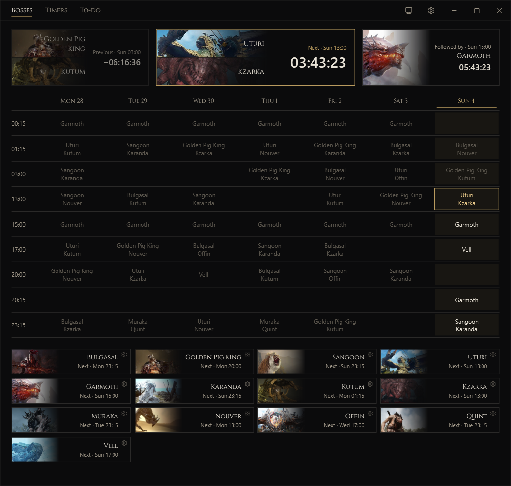
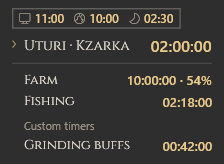

<p align="center">
  
</p>

<h1 align="center">BDO Timers</h1>

<p align="center">World bosses, life skill timers and checklists for Black Desert Online.</p>
<p align="center">Windows 10 / 11 &nbsp; · &nbsp; x64 &nbsp; · &nbsp; Europe &amp; North America</p>

<p align="center">
  <a href="https://github.com/feluminais/BdoTimers/releases"><strong>Releases</strong></a>
  &nbsp; · &nbsp;
  <a href="https://github.com/feluminais/BdoTimers/issues">Report an issue</a>
  &nbsp; · &nbsp;
  <a href="CONTRIBUTING.md">Build &amp; contribute</a>
</p>



## Bosses

See the previous, next and following spawn above a weekly timetable in your local time. Switch between EU and NA;
each region keeps its own alert settings and edited spawn times.

Choose which bosses you hear about, set how early to alert, or skip a single spawn. When an app update changes the
timetable, review the changes before applying them. [Timetable sources](docs/boss-region-sources.md).

Add your own event bosses with spawn times and optional date limits. Remove a boss from its panel or restore the bundled timetable in Settings.

## Timers


- **Farm:** track estimated crop growth, including overgrowth up to 200%. Set an earlier start time or the current
  growth percentage if you planted before opening the app.
- **Fishing:** count how long you've been fishing, with pause and resume.
- **Horse registration:** start a ten-minute wait when the game announces a registration. Run up to ten at once.
- **Guild bosses:** set your guild's schedule and have the overlay appear before it starts.
- **War of the Roses:** applications deadline and battle in one editable timer, with EU/NA times and a fortnightly repeat.

Add your own countdowns, weekly schedules and one-time events. Give a countdown a hotkey to start, pause and resume
it while playing, or control it from the tray menu. Pictures, sounds and spoken alert lines are customizable.

Weekly schedules can repeat every 1–52 weeks, with an anchor week and a label for each time. War of the Roses uses
Sunday 15:05 and 17:00 in Berlin for EU, or 13:05 and 15:00 Pacific for NA, anchored to the week of 20 September 2026.
Check official notices for changed battle weeks or cancellations; adjust the anchor or turn Alerts off during a
suspension. **Reset to EU/NA times** restores the selected region's defaults. [Schedule sources](docs/boss-region-sources.md).

## Calendar

See boss spawns, timers, one-time events and to-do resets in a month view. Select a day for its full list, open an item to edit it, or skip an upcoming occurrence.

## To-do


Daily and weekly lists clear at their configured reset times, including resets that passed while the app was closed.
Start with the included quests and tasks, edit them, or make your own lists. Group tasks into child rows; checking a
parent checks the group. Completed tasks move to the bottom.

## Alerts and overlay



Alerts can use sound, Windows notifications, offline speech and overlay pop-ups. Choose channels and lead times for
individual bosses and timed events. Speech uses the bundled Kokoro voice model. Add BDO Timers to Windows priority
notifications to allow alerts while Do Not Disturb is on.

The overlay shows boss spawns and running timers in a List, Card or Bar layout. Choose its size, opacity and sections,
including local, server and in-game time. Pin it, show it briefly with a hotkey, or let it appear for an alert. It can
fade or hide when the pointer gets close.

| Default shortcut | Action |
| --- | --- |
| Ctrl+Shift+F8 | Pin or unpin the overlay |
| Ctrl+Shift+F9 | Show the overlay for ten seconds |
| Ctrl+Shift+F10 | Start a horse registration timer |

Shortcuts can be changed or cleared. **The overlay needs borderless window mode.** It is a separate, click-through
Windows window; the app does not read game memory, inject code or send keyboard or mouse input to BDO.

## Install

Installers will be published on [Releases](https://github.com/feluminais/BdoTimers/releases). No release is published
yet; [build from source](CONTRIBUTING.md) to try the app.

The installer is `BdoTimers-Setup-<version>.exe`. It installs for your user, requires no admin rights and includes the
.NET runtime. The default folder is `%LocalAppData%\Programs\BdoTimers`; you can choose another writable folder.

Enable **Close to tray** to keep timers and alerts running after closing the window. **Start with Windows** launches
the app in the tray. Both are optional. Updates are offered as a link to the release page.

<details>
<summary>Data, backups and uninstalling</summary>

Timers, lists, settings, sounds, pictures and logs live in `Data` beside the app's executable. **Settings → Data**
exports or restores a backup ZIP. A restore keeps the previous data folder beside the restored one.

Run the installer again, or use **Windows Settings → Apps**, to repair or uninstall. Uninstall keeps your data unless
you clear **Keep my timers, lists and settings**.

For unattended installation, from a folder containing one installer:

```powershell
$setup = (Get-Item .\BdoTimers-Setup-*.exe).FullName
& $setup /quiet InstallRoot=D:\Games
& $setup /quiet /uninstall
```

`InstallRoot` is the parent folder; the example installs into `D:\Games\BdoTimers`. Silent uninstall keeps data;
add `DeleteData=1` to remove it.

</details>

## Contributing

See [CONTRIBUTING.md](CONTRIBUTING.md) for requirements, build commands and the project layout. Bug reports and
feature requests go to [Issues](https://github.com/feluminais/BdoTimers/issues). For a timetable error, include the
region, boss, time and source.

## License

[GPL-3.0](LICENSE). Bundled dependencies are listed in [THIRD-PARTY-NOTICES.txt](THIRD-PARTY-NOTICES.txt).

BDO Timers is not affiliated with Pearl Abyss. The boss, farm, fishing, horse and guild artwork belongs to
© Pearl Abyss and is not covered by the GPL.
